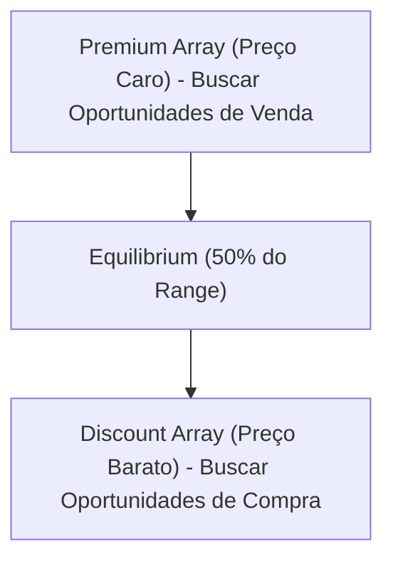

# ⏰ Nota Mestra: Algoritmo IPDA, Dealing Ranges & Ciclos de Tempo

Este documento codifica as regras de funcionamento do **IPDA (Interbank Price Delivery Algorithm)**, detalhando os ciclos de tempo de 20, 40 e 60 dias e as janelas institucionais de manipulação.

---

## 1. O Algoritmo IPDA (Interbank Price Delivery Algorithm)
O IPDA é o algoritmo centralizado interbancário que controla e distribui os preços no mercado financeiro. Ele opera com base em duas funções principais:
1. **Buscar Liquidez (Liquidity Pools)**: Caçar ordens de stop loss de varejo (BSL/SSL).
2. **Rebalancear Ineficiências (Rebalance Imbalances)**: Preencher Fair Value Gaps (FVG) e ineficiências de vácuo de liquidez.

---

## 2. As Regras de Lookback Institucional (20, 40, 60 Dias)
O IPDA analisa o histórico de dados com base em ciclos rígidos de trading days (dias úteis):

*   **Lookback de 20 Dias (Ciclo de Curto Prazo)**:
    *   Mapeia as máximas e mínimas mais próximas do último mês de negociação.
    *   Representa o foco imediato do algoritmo para capturar liquidez de curto prazo.
*   **Lookback de 40 Dias (Ciclo de Médio Prazo)**:
    *   Mapeia o range de liquidez intermediário.
*   **Lookback de 60 Dias (Ciclo de Longo Prazo)**:
    *   Mapeia os extremos de liquidez estrutural macro. Grandes reversões de tendência costumam acontecer após a captura dos extremos de 60 dias.

### Como a IA aplica o Lookback:
1.  No gráfico diário, marcar as máximas e mínimas absolutas de 20, 40 e 60 dias úteis atrás.
2.  Identificar se o preço atual acabou de capturar uma máxima ou mínima do ciclo de 20 dias.
3.  **A Regra da Reversão IPDA**: Se o preço captura a máxima de 20 dias, a expectativa algorítmica passa a ser de reversão em direção ao desconto (buscando a FVG diária mais próxima ou a mínima oposta do lookback).

---

## 3. Central Bank Dealing Range (Premium vs Discount Arrays)
O IPDA divide qualquer range de negociação ativo (Dealing Range) em exatamente dois blocos iguais de 50% (nível de equilíbrio):

### Regras de Execução de Arrays:
*   **Proibição de Compra em Premium**: A IA está estritamente proibida de comprar ativos acima do nível de 50% do Dealing Range do lookback de 20 dias, mesmo sob sinais locais bullish.
*   **Proibição de Venda em Discount**: A IA está proibida de vender ativos abaixo do nível de 50% do Dealing Range, mesmo sob sinais locais bearish.

---

## 4. O Checklist do Ciclo IPDA para a IA
*   [ ] **Dealing Range Definido**: Identificado os extremos máximos e mínimos do lookback institucional aplicável.
*   [ ] **Estado de Equilíbrio**: O preço atual foi classificado corretamente em zona de Premium ou Discount.
*   [ ] **DOL Alinhado com IPDA**: O Draw on Liquidity aponta para uma ineficiência ou pool de liquidez na direção do equilíbrio/extremo oposto.
*   [ ] **Janela de Tempo (Killzone)**: A operação está sendo executada exatamente durante o pico de volume do IPDA (Londres ou Nova York).

---

---

## 🔗 Conexões Neurais
- [[Cerebro_ICT]]
- [[B03 Regras ICT/Daily_Bias_e_Order_Flow|Daily Bias & Order Flow]]
- [[B03 Regras ICT/Modelo_Mentoria_2023_e_MMXM|Mentoria 2023 & MMXM]]
- [[B03 Regras ICT/ICT_FVG_YouTube_Distilled]]
- [[B03 Regras ICT/ICT_GestaoRisco_YouTube_Distilled]]
- [[B03 Regras ICT/ICT_Killzones_YouTube_Distilled]]
- [[B03 Regras ICT/ICT_Liquidity_YouTube_Distilled]]
- [[B03 Regras ICT/ICT_ModelosTrade_YouTube_Distilled]]
- [[B03 Regras ICT/ICT_OTE_YouTube_Distilled]]