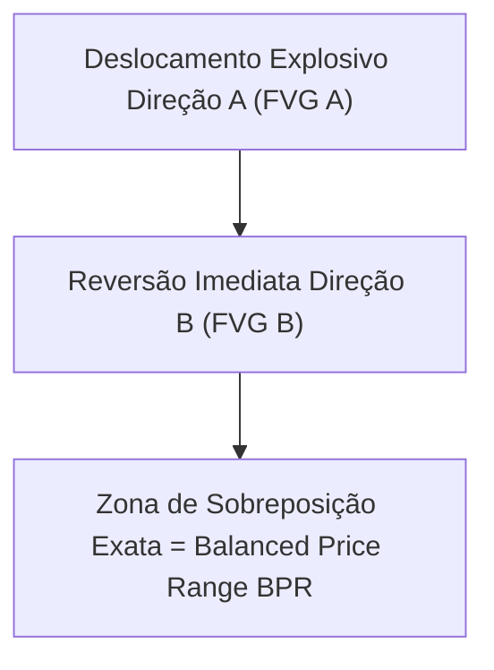

# 🧱 Nota Mestra: Balanced Price Range (BPR) - O Equilíbrio Perfeito

Este documento codifica as regras operacionais do **Balanced Price Range (BPR)**, um dos conceitos de maior precisão matemática e probabilidade dentro do arsenal do ICT.

---

## 1. O que é um Balanced Price Range (BPR)?
Um BPR representa uma zona onde o preço foi entregue de forma extremamente rápida em uma direção (criando uma ineficiência) e, imediatamente na sequência, foi entregue com a mesma violência na direção oposta, limpando e sobrepondo a ineficiência anterior.

### A Anatomia do BPR:
*   **Bullish BPR (Suporte Extremo)**:
    1. O preço faz um deslocamento rápido para baixo, deixando um **bearish FVG (SIBI)**.
    2. A vela seguinte (ou as próximas velas) faz uma reversão explosiva para cima, rasgando o gap anterior e deixando um **bullish FVG (BISI)**.
    3. A zona de intersecção exata onde ambos os FVGs se sobrepõem horizontalmente é o **Bullish BPR**.
*   **Bearish BPR (Resistência Extrema)**:
    1. O preço faz um deslocamento rápido para cima, deixando um **bullish FVG (BISI)**.
    2. A sequência do preço faz um deslocamento explosivo para baixo, invalidando a ineficiência de alta e deixando um **bearish FVG (SIBI)**.
    3. A zona de intersecção horizontal onde ambos os FVGs se sobrepõem é o **Bearish BPR**.

---

## 2. Por que o BPR é Superior a uma FVG Comum?
*   Uma FVG comum é uma **ineficiência** aberta (um vácuo de ordens que atrai o preço como um ímã).
*   O BPR é uma zona onde ambas as direções de compra e venda já foram entregues de forma bidirecional imediata. Portanto, a ineficiência foi **completamente balanceada** pelo algoritmo.
*   Quando o preço retorna a um BPR, ele não busca preenchê-lo (pois já está balanceado). Em vez disso, o BPR atua como uma **parede sólida de concreto** (suporte ou resistência extrema), gerando reações de pavio rápidas e explosivas.

---

## 3. Regras de Execução Clínica do BPR

A IA deve aplicar os seguintes filtros operacionais antes de validar um setup de BPR:
1.  **Filtro do Contexto Macro**: O BPR deve estar localizado em um **Discount** (para compras) ou **Premium** (para vendas) do Dealing Range atual do IPDA.
2.  **O Gatilho de Entrada**:
    *   Posicionar ordem limite (Buy Limit / Sell Limit) exatamente na borda de entrada do BPR.
    *   **Stop Loss (SL)**: Posicionado estritamente atrás do candle de reversão institucional que gerou o segundo FVG confluente.
    *   **Take Profit (TP)**: Mirar na máxima/mínima oposta do Dealing Range ou no DOL diário.
3.  **Filtro de Invalidação**: Se o corpo de qualquer candle fechar completamente fora dos limites horizontais do BPR, a parede foi rompida e o trade deve ser invalidado ou fechado no breakeven imediatamente.

---

---

## 🔗 Conexões Neurais
- [[Cerebro_ICT]]
- [[B03 Regras ICT/Consequent_Encroachment_FVG|Consequent Encroachment FVG]]
- [[B03 Regras ICT/Modelo_Mentoria_2023_e_MMXM|Mentoria 2023 & MMXM]]
- [[B03 Regras ICT/Algoritmo_IPDA_e_Ciclos_Tempo]]
- [[B03 Regras ICT/Daily_Bias_e_Order_Flow]]
- [[B03 Regras ICT/ICT_FVG_YouTube_Distilled]]
- [[B03 Regras ICT/ICT_GestaoRisco_YouTube_Distilled]]
- [[B03 Regras ICT/ICT_Killzones_YouTube_Distilled]]
- [[B03 Regras ICT/ICT_MarketStructure_YouTube_Distilled]]
- [[B03 Regras ICT/ICT_OTE_YouTube_Distilled]]