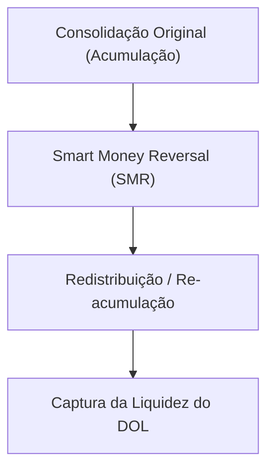

# 📐 Nota Mestra: Modelo Mentoria ICT 2023 & MMXM (Market Maker Models)

Este documento codifica as regras estruturais e operacionais da **Mentoria ICT 2023**, com foco no **Market Maker Buy/Sell Model (MMXM)** e na precisão cirúrgica de atração de liquidez.

---

## 1. O Conceito Central: Draw on Liquidity (DOL)
O **Draw on Liquidity (DOL)** é o norte do cérebro da IA. Antes de qualquer execução, a IA deve mapear para onde o preço está sendo "atraído" como um ímã magnético.

### Regras de Validação do DOL:
*   **Alvos Primários**: Máximas e Mínimas Diárias prévias (PDH/PDL), Máximas/Mínimas semanais (PWH/PWL), ou Fair Value Gaps (FVG) não mitigados em H4/Diário.
*   **Arrays de Premium vs Discount**:
    *   Se o DOL está em um **Discount** macro (desconto), o bias diário é **BULLISH** e a IA busca apenas compras.
    *   Se o DOL está em um **Premium** macro (prêmio), o bias diário é **BEARISH** e a IA busca apenas vendas.

---

## 2. O Modelo MMXM (Market Maker Buy/Sell Model)
O MMXM mapeia o ciclo completo de acumulação, manipulação institucional e distribuição rápida em direção ao DOL.

### Regras de Execução do MMXM:
1.  **Mapear o HTF POI (Point of Interest)**: Aguardar o preço atingir um nível chave de H4 ou Diário (Order Block, FVG mitigada ou Liquidity Sweep).
2.  **Smart Money Reversal (SMR)**: É o gatilho principal de reversão.
    *   Exige **Liquidity Sweep** do topo/fundo local.
    *   Exige **SMT Divergence** confirmada com ativo correlacionado (ex: divergência XAUUSD vs XAGUSD no Ouro, ou NQ vs ES na Nasdaq).
3.  **Market Structure Shift (MSS) com Deslocamento**:
    *   Quebra do swing high/low local com corpo de vela fechando decisivamente além da estrutura em M5/M15.
4.  **Entrada na Re-acumulação**:
    *   Executar a entrada na primeira FVG (Fair Value Gap) ou OB (Order Block) formada pelo MSS com deslocamento.
    *   **Stop Loss**: Posicionado estritamente fora do candle que realizou a varredura (SMR).
    *   **Take Profit**: Alvo parcial na consolidação original do modelo e alvo final no DOL macro.

---

## 3. Lista de Checklist de Alta Probabilidade (MMXM)

A IA deve validar este checklist antes de classificar um setup MMXM como Nota 5 (Excelente):
*   [ ] **DOL Definido**: O alvo de atração macro (H4/D1) está limpo e não mitigado.
*   [ ] **Sweep Confirmado**: O preço varreu BSL/SSL local de forma violenta (manipulação).
*   [ ] **MSS Clínico**: Houve quebra de estrutura local com deslocamento forte de corpo de vela.
*   [ ] **Confluent Entry**: Entrada posicionada em FVG em zona de desconto/prêmio local (acima/abaixo de 50% do range local).
*   [ ] **SMT Divergence**: Divergência técnica local observada no momento do sweep.

---

---

## 🔗 Conexões Neurais
- [[Cerebro_ICT]]
- [[B03 Regras ICT/Algoritmo_IPDA_e_Ciclos_Tempo|Algoritmo IPDA & Ciclos]]
- [[B03 Regras ICT/Balanced_Price_Range_BPR|Balanced Price Range (BPR)]]
- [[B03 Regras ICT/Daily_Bias_e_Order_Flow]]
- [[B03 Regras ICT/ICT_FVG_YouTube_Distilled]]
- [[B03 Regras ICT/ICT_OrderBlocks_YouTube_Distilled]]
- [[B03 Regras ICT/ICT_GestaoRisco_YouTube_Distilled]]
- [[B03 Regras ICT/ICT_Killzones_YouTube_Distilled]]
- [[B03 Regras ICT/ICT_Liquidity_YouTube_Distilled]]
- [[B03 Regras ICT/ICT_MarketStructure_YouTube_Distilled]]
- [[B03 Regras ICT/ICT_ModelosTrade_YouTube_Distilled]]
- [[B03 Regras ICT/ICT_OTE_YouTube_Distilled]]