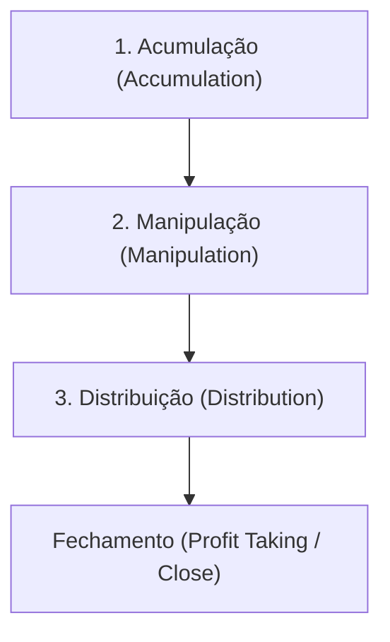

# 📐 Nota Mestra: Power of 3 (PO3) & AMD (Accumulation, Manipulation, Distribution)

Este documento codifica o conceito do **Power of 3 (PO3)** e o ciclo **AMD (Acumulação, Manipulação, Distribuição)**, que formam a base analítica do ICT para prever a movimentação intradiária institucional de preços.

---

## 1. O Conceito de Power of 3 (PO3)

O **Power of 3** baseia-se na anatomia de qualquer vela de alta probabilidade (seja diária, semanal ou de 4 horas). Toda vela bem desenvolvida é composta por três fases fundamentais que correspondem ao comportamento do algoritmo interbancário (IPDA):



### As Três Fases:

1.  **Acumulação (Accumulation)**: 
    *   Ocorre na abertura da sessão (ou do dia). O preço consolida em uma faixa estreita de preço. 
    *   O Smart Money acumula posições longas ou curtas sem deslocar o preço bruscamente.
2.  **Manipulação (Manipulation)**:
    *   O preço se move na direção **oposta** ao verdadeiro viés direcional do dia (Daily Bias).
    *   Este movimento falso é chamado de **Judas Swing** (Balanço de Judas). Ele serve para varrer stops de traders de varejo e induzir traders a entrarem no sentido errado.
    *   *Regra de Ouro*: O algoritmo manipula o preço para a zona de **Desconto** (abaixo do preço de abertura) antes de subir, ou para a zona de **Prêmio** (acima da abertura) antes de cair.
3.  **Distribuição (Distribution)**:
    *   O movimento real e agressivo em direção ao DOL (Draw on Liquidity). O preço se expande de forma unilateral com velas fortes de corpo cheio, criando o corpo principal do candle.
    *   Termina com o fechamento do candle no final do dia ou sessão, deixando um pavio curto do lado oposto.

---

## 2. A Anatomia das Velas e o Midnight Open (Abertura de Meia-Noite)

O preço de **abertura da meia-noite (00:00 EST / Horário de Nova York)** é a linha de equilíbrio crítica do dia. Qualquer execução institucional utiliza este nível como referência de preço justo:

### Vela Bullish (Alta)
*   **Abertura (Open)**: Inicia o dia.
*   **Acumulação**: Preço oscila perto da abertura.
*   **Manipulação (Judas Swing)**: O preço cai **abaixo** do Midnight Open (limpando SSL). Este é o momento ideal para procurar compras em **Desconto**.
*   **Distribuição**: Expansão forte de alta que cruza o Midnight Open e segue em direção ao DOL (PDH, FVG HTF).
*   **Fechamento (Close)**: Fecha próximo à máxima, criando a sombra/wick superior.

```
       [Máxima]
          |
       +-----+
       |     |
       |     |  <-- Distribuição (Expansão de Alta)
       |     |
       +-----+  <-- Midnight Open (Abertura)
          |     <-- Manipulação (Judas Swing em Desconto)
       [Mínima]
```

### Vela Bearish (Baixa)
*   **Abertura (Open)**: Inicia o dia.
*   **Acumulação**: Preço oscila perto da abertura.
*   **Manipulação (Judas Swing)**: O preço sobe **acima** do Midnight Open (limpando BSL). Este é o momento ideal para procurar vendas em **Prêmio**.
*   **Distribuição**: Expansão forte de baixa que cruza o Midnight Open e segue em direção ao DOL (PDL, FVG HTF).
*   **Fechamento (Close)**: Fecha próximo à mínima, criando a sombra/wick inferior.

```
       [Mínima]
          |     <-- Manipulação (Judas Swing em Prêmio)
       +-----+  <-- Midnight Open (Abertura)
       |     |
       |     |  <-- Distribuição (Expansão de Baixa)
       |     |
       +-----+
          |
       [Máxima]
```

---

## 3. Checklist de Entrada Operacional (AMD)

Para que a IA ou o Trader valide um setup de alta probabilidade usando AMD:

*   [ ] **Daily Bias Mapeado (D1/H4)**: Identificar a direção provável da vela diária (ex: se o DOL estiver acima, o viés é Bullish).
*   [ ] **Midnight Open Marcado**: Plotar a linha do preço de abertura das 00:00 EST.
*   [ ] **Aguardar a Janela de Tempo (Killzone)**: Aguardar o Judas Swing ocorrer durante o London Open (02:00-05:00 EST) ou NY AM (08:30-11:00 EST).
*   [ ] **Identificar a Manipulação**:
    *   Se Bullish: O preço deve cair abaixo do Midnight Open.
    *   Se Bearish: O preço deve subir acima do Midnight Open.
*   [ ] **Varredura de Liquidez (Sweep)**: O Judas Swing deve varrer uma mínima/máxima local (Asian Range, 24h High/Low ou EQL/EQH).
*   [ ] **Market Structure Shift (MSS)**: No gráfico de 5m ou 1m, aguardar uma quebra de estrutura na direção do viés.
*   [ ] **Entrada com Risco Calculado**: Entrar no reteste da FVG ou Breaker Block formado pelo MSS, desde que a entrada ainda esteja na zona barata (abaixo do Midnight Open para BUY, ou acima para SELL).

---

## 🔗 Conexões Neurais
- [[Cerebro_ICT]]
- [[B03 Regras ICT/Daily_Bias_e_Order_Flow|Daily Bias & Order Flow]]
- [[B03 Regras ICT/Modelo_Mentoria_2023_e_MMXM|Mentoria 2023 & MMXM]]
- [[B03 Regras ICT/Algoritmo_IPDA_e_Ciclos_Tempo|Algoritmo IPDA & Ciclos]]
- [[B03 Regras ICT/ICT_FVG_YouTube_Distilled]]
- [[B03 Regras ICT/ICT_OrderBlocks_YouTube_Distilled]]
- [[B03 Regras ICT/ICT_Killzones_YouTube_Distilled]]
- [[B03 Regras ICT/ICT_Liquidity_YouTube_Distilled]]
- [[B03 Regras ICT/ICT_MarketStructure_YouTube_Distilled]]
- [[B03 Regras ICT/ICT_ModelosTrade_YouTube_Distilled]]