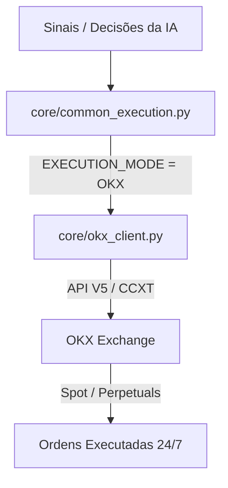

# Relatório de Análise da Corretora OKX (Brasil)
> [!NOTE]
> Esta análise foi elaborada com foco na viabilidade de negociação de criptoativos e integração técnica com a arquitetura do nosso robô **Trading AI**.

---

## 📈 1. Visão Geral da OKX

A **OKX** é uma das maiores exchanges de criptomoedas do mundo (geralmente ranqueada no Top 3 global ao lado de Binance e Bybit em volume de negociação e liquidez). A corretora destaca-se por oferecer uma infraestrutura de alto desempenho, robusta e muito apreciada por traders institucionais e de alta frequência (HFT).

### Pontos Fortes Globais:
- **Alta Liquidez:** Spreads extremamente baixos nos principais pares (BTC/USDT, ETH/USDT, SOL/USDT, etc.), garantindo mínima derrapagem (*slippage*) de ordens.
- **Diversidade de Mercados:** Oferece Spot (à vista), Margem, Futuros (Contratos Perpétuos e Trimestrais), Opções e Staking.
- **Segurança Sólida:** Prova de Reservas (PoR) 100% transparente atualizada mensalmente, além de fundos de seguro robustos.

---

## 🇧🇷 2. Operações no Brasil (Regulamentação e Depósitos)

A OKX possui presença oficial e adaptada no Brasil, oferecendo uma experiência perfeitamente localizada:

*   **Depósitos e Retiradas Rápidas via PIX:** Suporte nativo a depósitos em Reais (BRL) via PIX, com o valor mínimo de entrada de **apenas R$ 5,00**. O processamento é instantâneo e livre de taxas de depósito.
*   **Conformidade Fiscal e Regulação:** A OKX opera sob uma entidade legal brasileira (**OKX Serviços Digitais Ltda**), atuando em conformidade com as regras do **Banco Central do Brasil (BCB)** e reportando transações à **Receita Federal** nos termos da **Instrução Normativa RFB nº 1.888/2019**.
*   **Comissão de Valores Mobiliários (CVM):** A OKX não comercializa valores mobiliários tradicionais regulados pela CVM no Brasil. O mercado de futuros de criptoativos está acessível em sua plataforma global para usuários locais, mas é importante monitorar as normas vigentes sobre intermediação ativa no país.

---

## 💸 3. Estrutura de Taxas e Tarifas

A OKX possui um dos modelos de tarifas mais agressivos e baratos do setor, estruturado em níveis VIP de acordo com o saldo da conta e o volume operado nos últimos 30 dias.

| Categoria | Maker (Formador de Mercado) | Taker (Tomador de Mercado) |
| :--- | :--- | :--- |
| **Spot (À Vista) - Nível Regular 1** | **0.08%** | **0.10%** |
| **Futuros e Perpétuos - Nível Regular 1** | **0.02%** | **0.05%** |

> [!TIP]
> **Como reduzir ainda mais as taxas:** 
> 1. Mantendo o token nativo **OKB** em carteira para obter descontos progressivos.
> 2. Atingindo volumes operados maiores (VIP 1 a VIP 5+), onde as taxas Maker podem se tornar **zero ou negativas** (a corretora paga para você colocar ordens limite).

---

## 🛠️ 4. Viabilidade e Integração Técnica (API & CCXT)

Este é o ponto mais atrativo para o nosso projeto. A OKX possui uma API V5 moderna, rápida e extremamente estável. Ela é totalmente suportada pela biblioteca de integração **CCXT** em Python, que já usamos conceitualmente na arquitetura.

### Vantagens do Ambiente de Desenvolvimento:
*   **Demo Trading (Paper Trading) Completo via API:** A OKX oferece um ambiente de testes de fidelidade ultra-alta (sandbox). Diferente de outras corretoras, o Demo Trading da OKX usa credenciais de API dedicadas geradas dentro do console da conta de testes e exige um cabeçalho customizado na conexão.
*   **Configuração via CCXT:**
    ```python
    import ccxt

    exchange = ccxt.okx({
        'apiKey': 'SUA_CHAVE_API_DEMO',
        'secret': 'SEU_SEGREDO_API_DEMO',
        'password': 'SUA_PASSPHRASE_DEMO',  # Exigido pela OKX
        'headers': {
            'x-simulated-trading': '1',     # Roteia todas as operações para o simulador da OKX
        },
        'enableRateLimit': True,
    })

    # Testando a conexão
    balance = exchange.fetch_balance()
    print(balance)
    ```

---

## ⚖️ 5. Comparativo: OKX vs. Corretores Atuais da Nossa IA

Atualmente, nosso robô opera com suporte a **MetaTrader 5 (MT5)**, **Tradovate** e **Simulador Local**. Veja como a OKX se compara a eles:

| Característica | MetaTrader 5 (CFDs / Ouro) | Tradovate (Futuros de Índices) | OKX (Criptoativos) |
| :--- | :--- | :--- | :--- |
| **Ativos** | Índices CFDs (NQ, ES) e Ouro | Contratos futuros reais (NQ, ES) | Cripto Spot e Contratos Perpétuos |
| **Horário de Trading** | Fechamento diário e fins de semana | Fecha nos fins de semana | **24/7 (Nunca fecha)** |
| **Taxas de Conexão** | Nenhuma | Custos mensais de plataforma + Market Data | **100% Gratuito** |
| **Dependência de Software** | Requer o terminal MT5 Windows aberto em background | Conexão API direta baseada em nuvem | **Conexão API direta e ultra leve via Python** |
| **Simulador Realista** | Conexão demo da corretora no terminal MT5 | Conta de simulação Tradovate | **Conta Demo API de altíssima fidelidade** |
| **Spread / Slip** | Variável e às vezes alto | Extremamente baixo | **Extremamente baixo nos principais ativos** |

---

## 🚀 6. Proposta de Arquitetura e Integração

Para nos beneficiarmos da OKX, podemos integrá-la como um novo motor de execução. A nossa estrutura altamente modular facilita este processo.



### Plano de Ação Recomendado para Integração:
1.  **Criar `core/okx_client.py`:** Implementar o cliente baseado em CCXT capaz de autenticar, enviar ordens Spot/Perpétuos com Stop Loss (SL) e Take Profit (TP), e ler posições ativas.
2.  **Atualizar `config.py`:** Adicionar suporte para as novas credenciais da OKX e a variável de ambiente `EXECUTION_MODE = "OKX"`.
3.  **Atualizar `core/common_execution.py`:** Rotear os sinais de trading para a OKX quando o modo estiver ativo.
4.  **Testes em Demo Trading:** Validar todo o fluxo operando em conta simulada oficial da OKX com o cabeçalho `'x-simulated-trading': '1'`, garantindo risco zero no período de teste do código.

---

## 📌 Conclusão e Próximos Passos

> [!IMPORTANT]
> A OKX é uma **excelente escolha** para operarmos cripto de forma profissional e automatizada. Ela oferece taxas muito baixas, excelente liquidez, depósito instantâneo via PIX em Reais, e uma das melhores APIs do mercado com suporte perfeito para nossa infraestrutura Python/CCXT.
